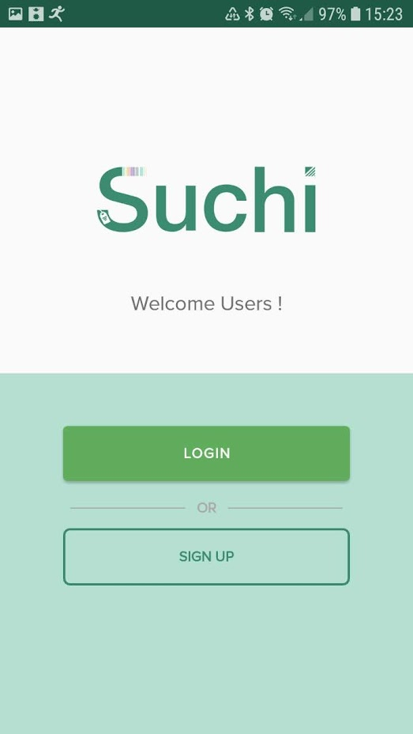
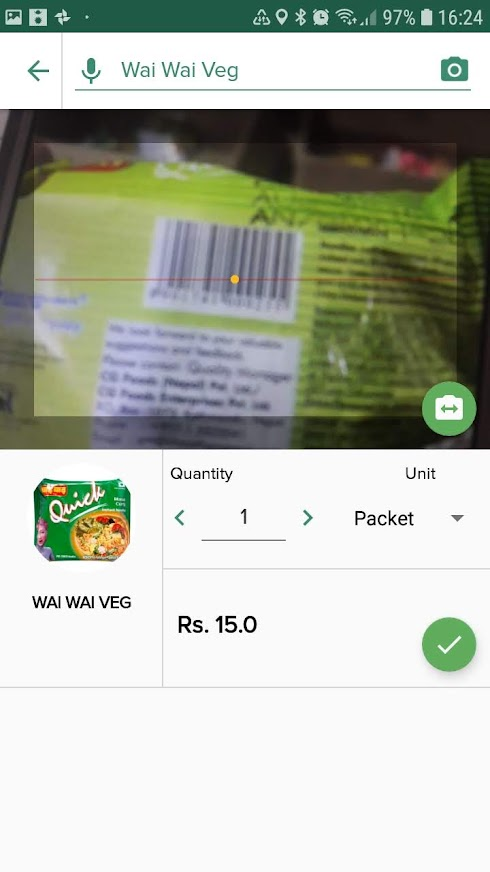
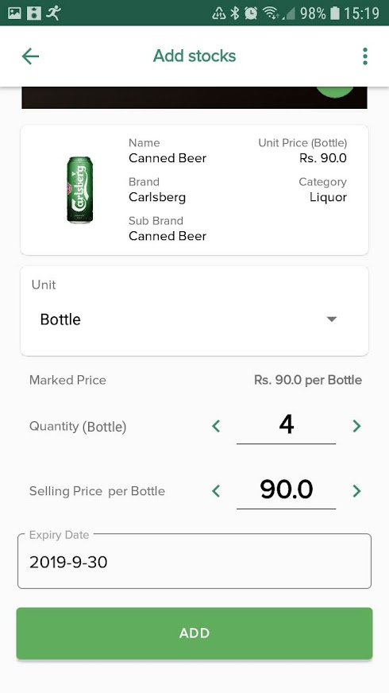
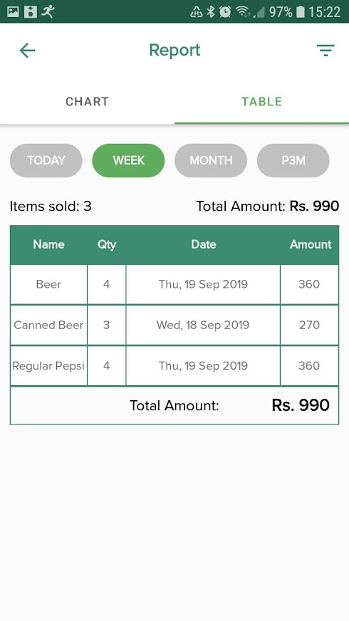
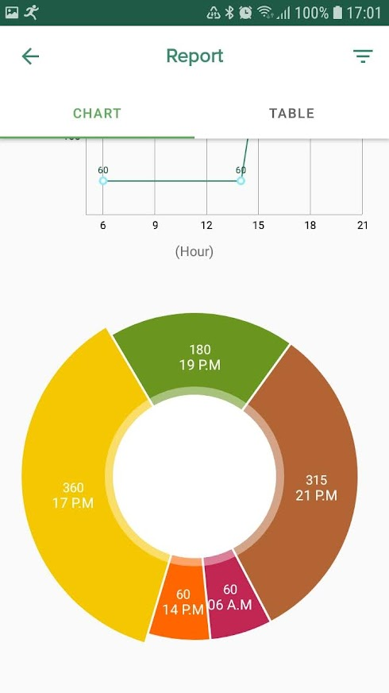
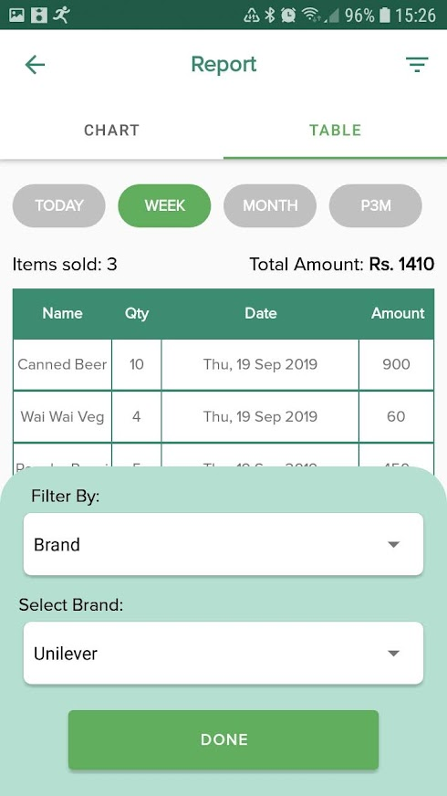
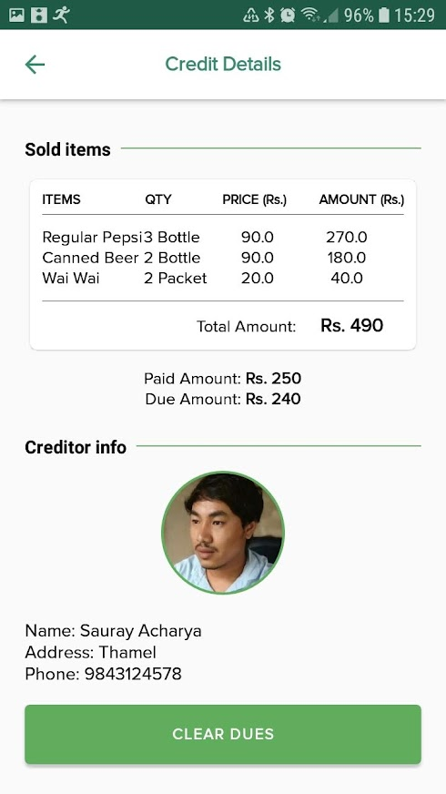

# Suchi

Suchi is a POS system for retail stores to handle the sales, inventory and credit management. It is all at once, a software solution built particularly for retail businesses to the small and midsize retailers to manage stocks and credits.

## Screenshots

                 

